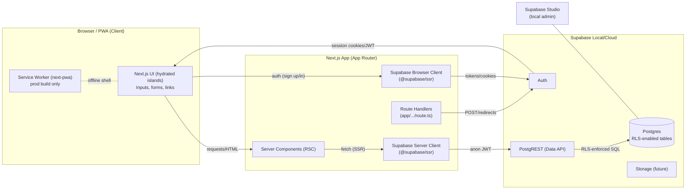
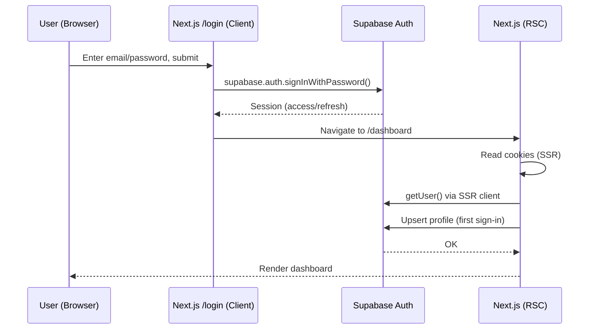
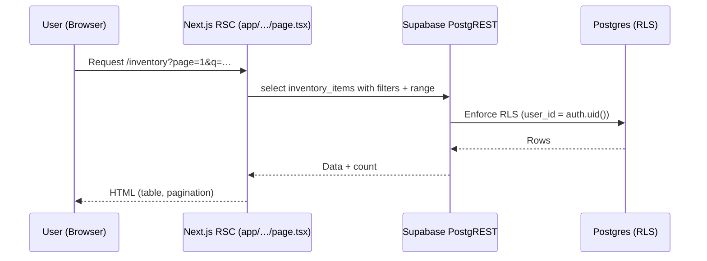
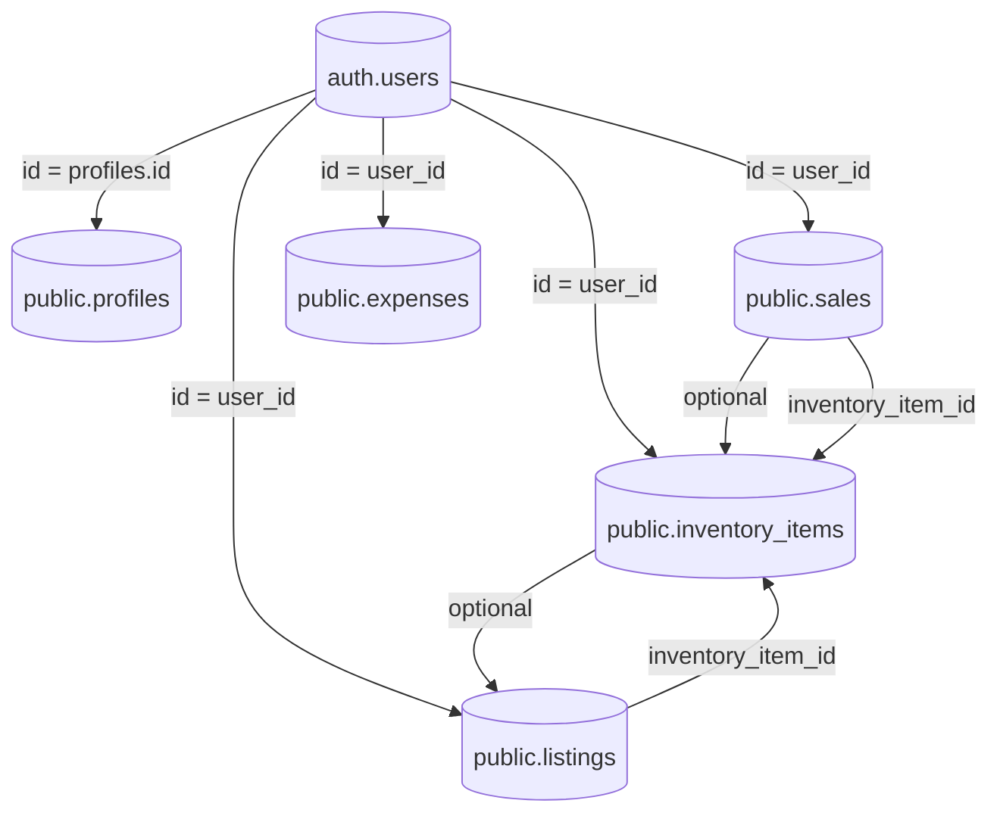

Resellr — Architecture (Phase 0–2)

This document describes the current architecture after Phases 0–2, along with key data flows and security boundaries.

## System Overview

- Client renders server-produced HTML from RSC. Minimal client JS is used (forms, actions).
- RSC and route handlers access Supabase via the SSR client with anon key and user session read from cookies.
- All data access is through PostgREST with Row Level Security (RLS) enforcing user ownership.
- The service worker is registered in production builds only.

## Auth (Phase 1) — Sequence

Notes
- Profiles are upserted on the first session.
- Sign-out uses a server route handler (POST /auth/signout) that clears the session and redirects.

## Data Access (Phase 2) — Sequence

- RLS policies exist for: inventory_items, listings, sales, expenses.
- Pagination is handled by PostgREST range with count: exact.

## Domain Model (Phase 2)

- All tables have user_id and RLS policies to scope to the owner.
- listings.inventory_item_id and sales.inventory_item_id are optional FKs to inventory_items.

## Security & Config

- Secrets: only anon key is used client-side; service role keys are never exposed.
- Cookies: httpOnly, sameSite=lax, secure in production; managed via @supabase/ssr.
- Headers: X-Frame-Options: SAMEORIGIN, Referrer-Policy: strict-origin-when-cross-origin, Permissions-Policy minimal.
- PWA: service worker enabled only in production builds (next-pwa).

## Build & Dev

- Local dev: supabase start, supabase migration up.
- Types: pnpm run db:types generates src/types/database.ts from local DB.
- Scripts: scripts/seed.mjs, scripts/cleanup.mjs, scripts/bulk_inventory.mjs, scripts/test_rls.mjs.

## Phase 3 (Preview)

- Add eBay OAuth connection (read-only sync), background sync (Edge Function or on-demand route), raw tables for audit, idempotent upserts to domain tables, and cursors for incremental fetches.
- Extend dashboard with marketplace status and last sync health.

